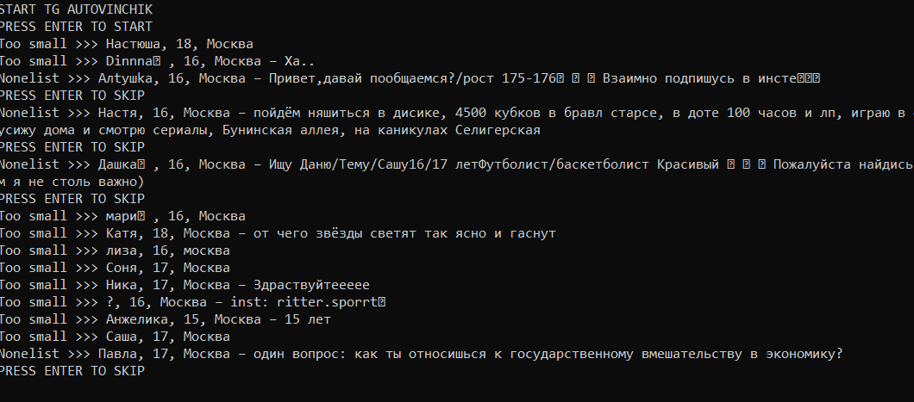
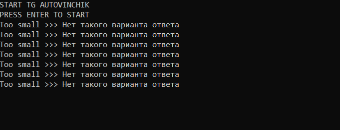

# AutoDaiVinchik
<h1>Авто винчик</h1>

Исправляет глупые ошибки разработчиков винчика, как например скипает людей, возраст которых меньше вашего (настраивается в конфиге путём указания возраста как фильтра в BLACKLIST, пр. ", 15,"). Позволяет сразу пропускать маргиналов/астролог_инь/забивных одним указанием в конфиге.

<h2>Установка</h2>

1. Скачать питон
2. Установить зависимости requirements.txt
3. Убрать расширение .example в конфиге
4. Добавить токены сетей в конфиг, в зависимости от тех которые будете использовать

<h2>Использование</h2>

1. Открыть нужный питон файл vk_ или tg_
2. В винчике выбрать режим поиска (Важно! Иначе работать не будет.)
3. Наслаждаться скипом овощей
4. Кликать ENTER когда просят, если вам конечно не нравится описание человека

<h2>Галерея</h2>

